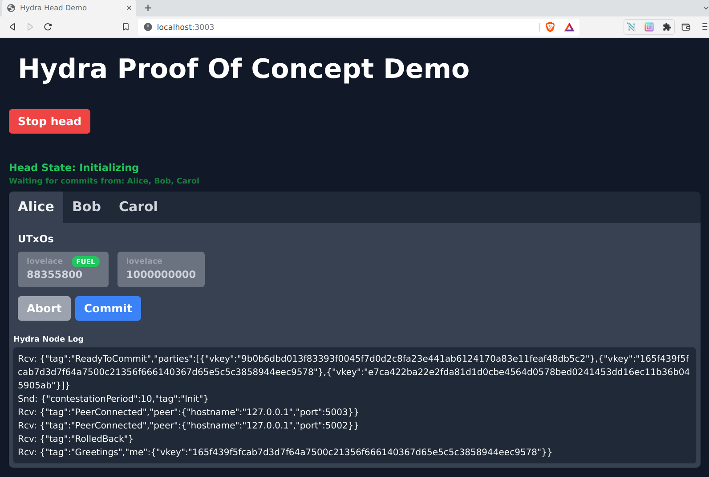

# <p align="center">Hydra Head Demo, Reflex-DOM edition</p>

This is an extended, graphical re-implementation of the original [Hydra Heads demo](https://github.com/input-output-hk/hydra-poc/tree/master/demo) implemented with [Reflex FRP](https://reflex-frp.org/).
It allows starting and closing a head with an arbitrary number of nodes, each with some initial amount of Ada to perform transactions within the head.

# Running

To run the demo enter a Nix shell and run it with `cabal`:

```
nix-shell -A shells.ghc default.nix --option substituters "https://cache.nixos.org https://cache.iog.io https://nixcache.reflex-frp.org" --option trusted-public-keys "cache.nixos.org-1:6NCHdD59X431o0gWypbMrAURkbJ16ZPMQFGspcDShjY= hydra.iohk.io:f/Ea+s+dFdN+3Y/G+FDgSq+a5NEWhJGzdjvKNGv0/EQ= ryantrinkle.com-1:JJiAKaRv9mWgpVAz8dwewnZe0AzzEAzPkagE9SP5NWI="

cabal run
```

The demo can then be viewed in **Chrome**(*Chrome must be used at this time because of a limitation in JSaddle*) at `http://localhost:3003/`.


